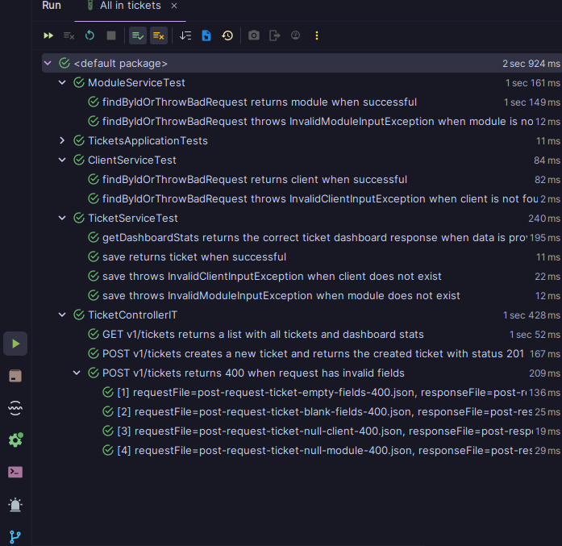

# Teste I - API de Chamados ⚠️

---

Esse desafio consistia na criação de tabelas para uma API de chamados, com endpoint que irá fazer uma consulta no banco
de dados apenas uma vez e a partir
dos dados obtidos fazer as devidas manipulações.
---

## Objetivos 📋:

1 - Retornar todos os tickets baseado no mês e no ano.

2 - Contabilizar os tickets por módulo e por cliente.

3 - Permitir cadastrar um ticket

---

## Tecnologias ⚙️:

- **Linguagem**: Java 21
- **Framework**: Spring Boot
- **Bando de Dados**: H2
- **Migrations**: Flyway
- **Validação**: Validation
- **Testes**: JUnit, Mockito, REST Assured
- **Documentação**: SwaggerUI
- **Extras**: Lombok

--- 

## Proposta de resolução:

A primeira coisa que pensei é que precisava trazer todos os dados de uma vez, para evitar o problema do N+1, então decidir 
fazer essa função que realizava fetch nas tabelas de client e module e passando parâmetros de consulta apenas para o mês e o ano específico.

```java
public interface TicketRepository extends JpaRepository<Ticket, Long> {

    @Query("""
                SELECT t
                FROM Ticket t
                JOIN FETCH t.client
                JOIN FETCH t.module
                WHERE t.openingDate >= :startDate AND t.openingDate < :endDate
            """)
    List<Ticket> findAllByMonthAndYear(@Param("startDate") LocalDate startDate,
                                       @Param("endDate") LocalDate endDate);

}
```

Com essa consulta consigo saber todos os tickets que foram criados a partir de tal mês e ano. Indo apenas uma vez no
banco e pronto para realizar os próximos relatórios.

Então na camada service, decidi fazer as manipulações necessárias para contabilizar a quantidade de tickets por módulo e
por cliente. Já que se eu tivesse que acessar o tamanho da lista a partir das entidades eu teria um problema, que era
que ele iria no banco toda vez que passe pela função de getTickets().

Com essa função groupingBy, consigo agrupar pelo tipo de da refêrencia(Cliente, ou Módulo) - que seria nossa key - e
passar uma função contadora como valor,
assim conseguindo obter o total necessário para devolver na resposta.

```java
private List<ClientDashboardResponse> summarizeTicketsByClient(List<Ticket> tickets) {
    return tickets.stream()
            .collect(groupingBy(Ticket::getClient, counting()))
            .entrySet().stream()
            .map(entry -> ClientDashboardResponse.from(entry.getKey(), entry.getValue()))
            .toList();
}

private List<ModuleDashboardResponse> summarizeTicketsByModule(List<Ticket> tickets) {
    return tickets.stream()
            .collect(groupingBy(Ticket::getModule, counting()))
            .entrySet().stream()
            .map(entry -> ModuleDashboardResponse.from(entry.getKey(), entry.getValue()))
            .toList();
}
```

Já na camada de controller, fiz apenas uma validação básica para caso o usuário não passasse o mês e nem o ano, pegasse
o ano e o mês atual.

```java

@GetMapping
public ResponseEntity<TicketDashboardResponse> findAll(@RequestParam(required = false) Integer year,
                                                       @RequestParam(required = false) Integer month) {

    LocalDate now = LocalDate.now();
    year = year != null ? year : now.getYear();
    month = month != null ? month : now.getMonthValue();

    var ticketsDashboardStats = service.getDashboardStats(year, month);
    return ResponseEntity.ok(ticketsDashboardStats);
}
```

Resposta:

```json
{
  "tickets": [
    {
      "id": 23,
      "title": "Erro ao gerar PDF da fatura",
      "clientName": "Microsoft",
      "moduleName": "Financeiro",
      "openingDate": "2025-10-01",
      "closingDate": "2025-10-03"
    },
    {
      "id": 24,
      "title": "Dashboard de vendas não carrega erro 500",
      "clientName": "Microsoft",
      "moduleName": "Financeiro",
      "openingDate": "2025-10-01",
      "closingDate": "2025-10-03"
    },
    {
      "id": 25,
      "title": "Login não funciona para novo usuário",
      "clientName": "Microsoft",
      "moduleName": "Vendas",
      "openingDate": "2025-10-02",
      "closingDate": "2025-10-04"
    }
    ...
  ],
  "clients": [
    {
      "id": 1,
      "name": "Apple Inc.",
      "totalTickets": 6
    },
    {
      "id": 2,
      "name": "Google",
      "totalTickets": 6
    },
    {
      "id": 3,
      "name": "Microsoft",
      "totalTickets": 8
    }
  ],
  "modules": [
    {
      "id": 1,
      "name": "Financeiro",
      "totalTickets": 6
    },
    {
      "id": 2,
      "name": "Vendas",
      "totalTickets": 4
    },
    {
      "id": 3,
      "name": "Expedição",
      "totalTickets": 4
    },
    {
      "id": 4,
      "name": "Foguetes",
      "totalTickets": 6
    }
  ]
}
```

Outra funcionalidade que foi requirida foi a possibilidade de cadastrar um ticket, então eu criei uma classe para fazer
o request usando Spring Validation:

```java

@Getter
@Setter
@Builder
public class TicketRequest {

    @Schema(description = "Error accessing the reports module", example = "Error accessing the reports module")
    @NotBlank(message = "Title is required")
    private String title;

    @Schema(description = "ID of the client who created the ticket", example = "1")
    @NotNull(message = "Client ID is required")
    private Long clientId;

    @Schema(description = "ID of the module associated with the ticket", example = "3")
    @NotNull(message = "Module ID is required")
    private Long moduleId;

    public Ticket toEntity() {

        Client client = new Client(clientId);
        Module module = new Module(moduleId);

        return Ticket.builder()
                .title(title)
                .client(client)
                .module(module)
                .build();
    }
}

```

No service eu busco as entidades para caso elas não existam, lançar exceptions de granularidade fina, assim podendo ter
mais controle sobre o que está acontecendo na minha aplicação:

```java

@Service
@RequiredArgsConstructor
public class TicketService {

    private final TicketRepository repository;

    private final ClientService clientService;
    private final ModuleService moduleService;

    @Transactional
    public Ticket save(Ticket ticket) {
        var client = clientService.findByIdOrThrowBadRequest(ticket.getClient().getId());
        var module = moduleService.findByIdOrThrowBadRequest(ticket.getModule().getId());
        ticket.setClient(client);
        ticket.setModule(module);
        ticket.setOpeningDate(LocalDate.now());
        return repository.save(ticket);
    }
```

Resultado final no controller:

```java

@RestController
@RequestMapping("/v1/tickets")
@RequiredArgsConstructor
public class TicketController implements TicketControllerDocs {

    private final TicketService service;

    @PostMapping
    public ResponseEntity<TicketResponse> save(@RequestBody @Valid TicketRequest request) {
        var ticket = request.toEntity();
        ticket = service.save(ticket);
        var response = TicketResponse.toResponse(ticket);
        return ResponseEntity.status(HttpStatus.CREATED).body(response);
    }
```

## Extras:

### Tratamento de Erros

Uma das funcionalidades que implementei, foi usar o Spring Validation e tratar essas exceptions para fácil leitura do
consumidor da API.
Exemplos:

Nessa requisição de Tickets (POST /v1/tickets), irei passar alguns dados inválidos:

```json
{
  "title": "",
  "clientId": 2,
  "moduleId": null
}
```

Assim a API irá me retornar os erros seguindo a especificação RFC 7807

Resposta:

```json
{
  "status": 400,
  "type": "https://api.chamados.com/invalid-data",
  "title": "Invalid data",
  "detail": "One or more fields are invalid. Correct and enter the correct values and try again.",
  "userMessage": "One or more fields are invalid. Correct and enter the correct values and try again.",
  "timestamp": "2025-10-05T21:08:45.362685736Z",
  "objects": [
    {
      "name": "moduleId",
      "userMessage": "Module ID is required"
    },
    {
      "name": "title",
      "userMessage": "Title is required"
    }
  ]
}
```

Mais um exemplo, caso o usuário passe um module ou client que não exista:

Requisição:

```json
{
  "title": "Title",
  "clientId": 99,
  "moduleId": 2
}
```

Resposta:

```json
{
  "status": 400,
  "type": "https://api.chamados.com/business-error",
  "title": "Business rule violation",
  "detail": "Cannot create ticket: client '99' is invalid or does not exist.",
  "userMessage": "Cannot create ticket: client '99' is invalid or does not exist.",
  "timestamp": "2025-10-05T21:11:28.746438793Z"
}

```

### Implementação de Testes Automatizados

Essa etapa eu considero bastante importante no desenvolvimento de software, então decidi aplicar alguns conceitos para
implementação de testes unitários e testes de integração.

#### Testes Unitários

Como nos testes unitários eu preciso ter total controle dos dados mockados, então criei uma classe utilitária para me ajudar nos testes:

```java

@Component
public class TicketUtils {

    public List<Client> createClients() {
        var client1 = Client.builder().id(1L).name("Client A").build();
        var client2 = Client.builder().id(2L).name("Client B").build();
        var client3 = Client.builder().id(3L).name("Client C").build();
        return new ArrayList<>(List.of(client1, client2, client3));
    }

    public Client createClient() {
        return Client.builder().id(1L).name("Client A").build();
    }

    public List<Module> createModules() {
        var module1 = Module.builder().id(1L).name("Module X").build();
        var module2 = Module.builder().id(2L).name("Module Y").build();
        var module3 = Module.builder().id(3L).name("Module Z").build();
        return new ArrayList<>(List.of(module1, module2, module3));
    }

    public Module createModule() {
        return Module.builder().id(1L).name("Module X").build();
    }

    public Ticket createTicket() {
        Client client = createClient();
        Module module = createModule();
        return Ticket.builder()
                .id(1L)
                .title("Sample Ticket")
                .client(client)
                .module(module)
                .openingDate(LocalDate.now())
                .build();
    }

    public List<Ticket> createTickets() {
        List<Client> clients = createClients();
        List<Module> modules = createModules();

        Ticket ticket1 = Ticket.builder()
                .id(1L)
                .title("Ticket 1")
                .client(clients.get(0))
                .module(modules.get(0))
                .openingDate(LocalDate.now())
                .build();

        Ticket ticket2 = Ticket.builder()
                .id(2L)
                .title("Ticket 2")
                .client(clients.get(1))
                .module(modules.get(1))
                .openingDate(LocalDate.now())
                .build();

        return new ArrayList<>(List.of(ticket1, ticket2));
    }
}

```

A partir daqui, eu conseguiria ter total controle sobre meus testes, garantindo mais confiabilidade e segurança na hora
de testar:

```java

@ExtendWith(MockitoExtension.class)
@TestMethodOrder(MethodOrderer.OrderAnnotation.class)
class TicketServiceTest {

    @Mock
    private TicketRepository ticketRepository;

    @Mock
    private ClientService clientService;

    @Mock
    private ModuleService moduleService;

    @InjectMocks
    private TicketService ticketService;

    private TicketUtils ticketUtils;

    private List<Ticket> ticketsList;

    @BeforeEach
    void setup() {
        ticketUtils = new TicketUtils();
        ticketsList = ticketUtils.createTickets();
    }

    @Test
    @Order(1)
    @DisplayName("getDashboardStats returns the correct ticket dashboard response when data is provided")
    void getDashboardStats_ReturnsCorrectTicketDashboardResponse_WhenDataIsProvided() {
        Integer year = 2025;
        Integer month = 10;

        BDDMockito.given(ticketRepository.findAllByMonthAndYear(
                LocalDate.of(year, month, 1),
                LocalDate.of(year, month, LocalDate.of(year, month, 1).lengthOfMonth())
        )).willReturn(ticketsList);

        TicketDashboardResponse dashboardResponse = ticketService.getDashboardStats(year, month);

        assertThat(dashboardResponse).isNotNull();

        assertThat(dashboardResponse.getTickets())
                .isNotNull()
                .hasSize(2);

        assertThat(dashboardResponse.getClients())
                .isNotNull()
                .hasSize(2);

        assertThat(dashboardResponse.getModules())
                .isNotNull()
                .hasSize(2);
    }

    @Test
    @Order(2)
    @DisplayName("save returns ticket when successful")
    void save_ReturnsTicket_WhenSuccessful() {
        Ticket ticketToBeSaved = ticketUtils.createTicket();
        ticketToBeSaved.setId(null);
        ticketToBeSaved.setOpeningDate(null);

        Client client = ticketToBeSaved.getClient();
        Module module = ticketToBeSaved.getModule();

        BDDMockito.given(clientService.findByIdOrThrowBadRequest(client.getId()))
                .willReturn(client);

        BDDMockito.given(moduleService.findByIdOrThrowBadRequest(module.getId()))
                .willReturn(module);

        BDDMockito.given(ticketRepository.save(BDDMockito.any(Ticket.class)))
                .willReturn(ticketToBeSaved);

        Ticket savedTicket = ticketService.save(ticketToBeSaved);

        assertThat(savedTicket).isNotNull();
        assertThat(savedTicket.getClient()).isEqualTo(client);
        assertThat(savedTicket.getModule()).isEqualTo(module);
        assertThat(savedTicket.getOpeningDate()).isNotNull();
    }

```

### Testes de Integração

Os testes de integração são os que mais chegam próximo do ambiente real, que irá para a produção. Por serem mais
pesados, já que carregam o contexto do Spring, decidi seguir com essa implementação:

Um arquivo de properties específico para criação do nosso banco de testes, usando migrations de teste também.

```yml
spring:
  datasource:
    url: jdbc:h2:mem:testdb
    driver-class-name: org.h2.Driver
    username: sa
    password: ''
  flyway:
    clean-disabled: true
    locations: classpath:db/migration-test
  jpa:
    show-sql: true
```

A utilização da biblioteca Rest Assured permite a criação de testes automatizados em uma linguagem fluente, o que
melhora a legibilidade e facilita a manutenção e compreensão do código por futuros desenvolvedores.

```java


@SpringBootTest(webEnvironment = SpringBootTest.WebEnvironment.RANDOM_PORT)
@TestMethodOrder(MethodOrderer.OrderAnnotation.class)
@Sql(value = "/sql/clean-tickets.sql", executionPhase = Sql.ExecutionPhase.AFTER_TEST_METHOD)
class TicketControllerIT extends IntegrationTestConfig {

    private static final String URL = "/v1/tickets";

    @Autowired
    private FileUtils fileUtils;

    @LocalServerPort
    private int port;

    @BeforeEach
    void setup() {
        RestAssured.baseURI = "http://localhost";
        RestAssured.port = port;
    }

    @Test
    @DisplayName("GET v1/tickets returns a list with all tickets and dashboard stats")
    @Sql("/sql/init-tickets-find-all.sql")
    @Order(1)
    void findAll_ReturnsListOfTicketsAndDashboardStats_WhenSuccessful() {

        String expectedJson = fileUtils.readResourceFile("ticket/get-ticket-dashboard-response-200.json");

        given()
                .accept(ContentType.JSON)
                .queryParam("year", 2025)
                .queryParam("month", 10)
                .when()
                .get(URL)
                .then()
                .statusCode(HttpStatus.OK.value())
                .body(equalTo(expectedJson));
    }


```

Testes Parametrizados: com testes parametrizados, consigo melhorar ainda mais a qualidade dos meus testes, permitindo
que eu teste muitas entradas de uma vez em um único teste:

```java


@ParameterizedTest
@MethodSource("provideInvalidTicketRequests")
@DisplayName("POST v1/tickets returns 400 when request has invalid fields")
@Order(3)
void save_ReturnsBadRequest_WhenRequestIsInvalid(String requestFile, String responseFile) {
    String ticketRequestJson = fileUtils.readResourceFile("ticket/" + requestFile);
    String expectedJsonResponse = fileUtils.readResourceFile("ticket/" + responseFile);

    var response = RestAssured.given()
            .contentType(ContentType.JSON).accept(ContentType.JSON)
            .body(ticketRequestJson)
            .when()
            .post(URL)
            .then()
            .statusCode(HttpStatus.BAD_REQUEST.value())
            .log().all()
            .extract().response().body().asString();

    JsonAssertions.assertThatJson(response)
            .whenIgnoringPaths("timestamp")
            .when(Option.IGNORING_ARRAY_ORDER)
            .isEqualTo(expectedJsonResponse);
}


private static Stream<Arguments> provideInvalidTicketRequests() {
    return Stream.of(
            Arguments.of("post-request-ticket-empty-fields-400.json", "post-response-ticket-empty-fields-400.json"),
            Arguments.of("post-request-ticket-blank-fields-400.json", "post-response-ticket-blank-fields-400.json"),
            Arguments.of("post-request-ticket-null-client-400.json", "post-response-ticket-null-client-400.json"),
            Arguments.of("post-request-ticket-null-module-400.json", "post-response-ticket-null-module-400.json")
    );
}

```

<details>
 <summary><b>Resultado</b></summary>
 
</details>

## Desenvolvedor

[Guilherme Thomaz](https://www.linkedin.com/in/thomazllr/)


